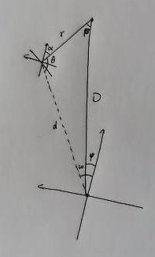

# 小陀螺自瞄

<!-- TOC -->

- [小陀螺自瞄](#%E5%B0%8F%E9%99%80%E8%9E%BA%E8%87%AA%E7%9E%84)
    - [调用方式](#%E8%B0%83%E7%94%A8%E6%96%B9%E5%BC%8F)
    - [调试方式](#%E8%B0%83%E8%AF%95%E6%96%B9%E5%BC%8F)
        - [角度](#%E8%A7%92%E5%BA%A6)
        - [静态](#%E9%9D%99%E6%80%81)
    - [原理](#%E5%8E%9F%E7%90%86)
        - [角度](#%E8%A7%92%E5%BA%A6)
            - [假设](#%E5%81%87%E8%AE%BE)
            - [建模思路](#%E5%BB%BA%E6%A8%A1%E6%80%9D%E8%B7%AF)
        - [静态](#%E9%9D%99%E6%80%81)
            - [假设](#%E5%81%87%E8%AE%BE)
            - [建模思路](#%E5%BB%BA%E6%A8%A1%E6%80%9D%E8%B7%AF)
            - [击打位置和时机的计算](#%E5%87%BB%E6%89%93%E4%BD%8D%E7%BD%AE%E5%92%8C%E6%97%B6%E6%9C%BA%E7%9A%84%E8%AE%A1%E7%AE%97)

<!-- /TOC -->

## 调用方式

AngleAimer为基于角度的陀螺自瞄，StaticAimer为静态陀螺自瞄，两者继承自Aimer基类。使用一个指向基类的shared_ptr，根据需要实例化对应的类。

主线程循环中调用

```c++
wmj::Armor wmj::Aimer::getFinalPose(wmj::GimbalPose &cur_pose, wmj::Armor &armor, float bullet_speed)
```

- 参数：

  cur_pose: 当前云台位姿

  armor: 识别到的装甲板

  bullet_speed: 当前射速

- 返回：

  目标位姿

```c++
bool wmj::Aimer::shootable()
```

- 返回：

  射击许可

---

## 调试方式

### 角度

1. 以当前状态机帧率和目标估计转速大致确认单个周期的记录帧数，一般以超过20为优，否则模型计算可能误差偏大。
2. 观察模型各数据输出，一般情况下基本稳定，则模型参数基本不需要调节。若每个周期击发子弹数量过少，可以适当增大角速度波动阈值、中心漂移和距离比例阈值以及最大击发窗口角度。
3. 若命中点位存在偏移，微调`time_off`和`angle_off`

### 静态

一块装甲板从视野中出现到消失的最少帧数限制为`m_min_vec_size`

通过水平距离差`horizontal_diff_max`判定是否切换到一块新装甲板

瞄准的基础是两块装甲板距离相机最近的位置，在这两个位置的基础上左右做一个线性的预测。目前是认为装甲板在最近位置附近近似做一个匀速直线运动，效果还行。日后会改为用参数方程。

---

## 原理


### 角度

#### 假设

1. 目标装甲板位于旋转中心四方，每两个相对的为一组，同组拥有同样的绝对高度和旋转半径
2. 目标绕旋转中心以恒定速度旋转，旋转中心可能缓慢移动
3. 装甲板相对角度测量较为精准（曝光环境）

#### 建模思路

1. 首先，角度方案主要参考的数据，装甲板相对角度，指目标装甲板相在相机中的yaw轴旋转角，以正对相机为零位，从上往下看逆时针为正方向。但是相对角度会随云台移动而测量出不同的数据，所以首先猜测对方的旋转半径，计算目标装甲板的绝对角度，即装甲板-对方旋转中心-己方旋转中心的三点的夹角。
   
   - $\alpha$ 为相机系中测量的装甲板相对角度，$\omega$ 可以通过装甲板在相机系中的相对坐标算得，根据这两个角度可以解出 $\theta$
   - $d$ 为装甲板距离己方旋转中心的距离，$r$ 为目标装甲板到对方旋转中心的距离
   - 由 $\theta$，$d$ 和 $r$ 可以通过余弦定理算得己方旋转中心到对方旋转中心的距离 $D$
   - 由 $D$，$d$ 和 $\theta$ 可以通过正弦定理算得绝对角度 $\beta$
2. 建模时，将每四分之一圈识别到的同一个装甲板当做一个周期，记录每个周期的绝对角度和绝对坐标数据。以每个周期的数据计算角速度、旋转中心、以及每组装甲板的旋转半径和绝对高度，并更新数据记录。
3. 若数据计算结果良好，认为模型建立成功，以模型解算结果返回目标装甲板位置，否则以线性预测返回目标装甲板位置。
4. 解算模型时，根据距离和射速在角度上施加预测提前量，若预测角度大于45°，认为攻击下一块装甲板更好，并模拟一个下一块装甲板应该出现的位置，注意修改旋转半径和绝对高度（若旋转速度过快或距离较远，可能会选择到下下块甚至更往后的装甲板，原理相同）。注意：由于该模型中定义的角度并非定义在相机系，亦非地面系，而是在一个由己方旋转中心和对方旋转中心确定的特殊坐标系，因此在计算目标装甲板绝对坐标时需额外经过一次坐标系变换的操作。

### 静态

#### 假设

- 目标绕一定坐标轴以固定转速旋转。
- 装甲检测能够精准识别装甲，不出现误识别。
- 发射延迟较为固定，波动幅度不大于20ms。

#### 建模思路

- 首先监测当前视野中的装甲直至发生目标切换(即该装甲从视野中消失，选择了另一块装甲)。判定获取到的总帧数是否符合要求。
  若符合要求，则该装甲可以作为1号装甲，开始建模，否则丢弃该组数据，将下一块置为1号装甲。

- 从1号装甲的数据中，找出其距离原点水平距离最近的一帧数据，记录时间戳，并标记为1号装甲的位置。方便起见，可以直接将1号的位置
  标记给3号(认为二者相对于旋转中心对称)
  同理，处理2号装甲。
  在识别完成两块装甲之后，即可初步完成建模，拥有了4块装甲的位置和车体转速，以及1、2号装甲出现的历史时间。

- "装甲位置"定义:文中所提到的"装甲位置"指每一块装甲距离云台原点最近时的位置

#### 击打位置和时机的计算

- 要考虑的因素有:
  1. 子弹飞行时间t1，需要考虑子弹射速和距离(已经获取到)
  2. 发弹延迟t2。
  3. 云台转动耗时t3(该值需要假定)。
  4. 目标转动速度rps.

- 计算方法
  根据最近的历史数据(最近出现的装甲位置和时间戳)，使用飞行时间+发弹延迟+云台运动时间，计算出一个子弹击中的最短耗时，
  假设为t，则rps\*t为转过的角度r，将r模90之后，若大于45则商加一。商加上历史装甲编号模4，即为要击打的装甲编号，商\*90/rps
  即为整个流程所需要的时间。

---

## 问题和优化方向

1. 目前主要选用的是精度较高的角度方案，但是对于角度测量的要求比较高，如果曝光环境不好模型会直接崩溃。现在测量角度是通过左右灯条在x轴和y轴的坐标做反正切，日后需要探索更好的角度测量方法，甚至重新考虑采用其他数据作为建模的数据来源。
2. 当目标旋转角速度达到2π时，每个周期能采集到的数据量仅有30左右（目前状态机帧率为120fps）；当速度更高时数据量会更少，此时角度测量精度乃至整个模型计算精度会严重下降。
3. 不管是静态方案还是角度方案目前对于边旋转边移动的陀螺都没有很好的解决思路，此内容有待研究。
4. 由于模型精度不高，但是状态机仍然需要反陀螺模块给出击发窗口。如果窗口过大，则实际命中率不高；如果窗口过小，命中率在提高的同时子弹的实际击发量会下降，甚至有时完全无法击发。解决这一矛盾的最好方法还是优化模型精度，其次是结合枪口冷却动态选择窗口阈值。