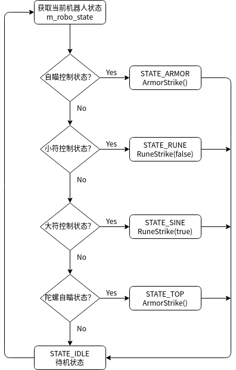
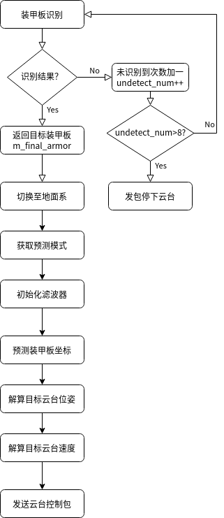
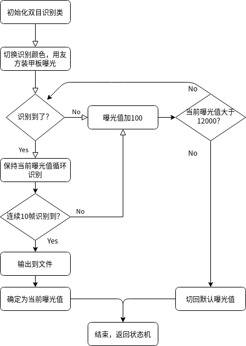

# WMJ状态机代码

状态机初始化各对象及参数。

```c++
    m_robot_control    = std::make_shared<wmj::WMJRobotControl>();
    m_usb_capture      = std::make_shared<wmj::UsbCapture>();
    m_angle_solver     = std::make_shared<wmj::AngleSolver>();
    m_speed_resolver   = std::make_shared<wmj::SpeedResolver>();
    m_motion_predictor = std::make_shared<wmj::MotionPredict>();
    m_armor_detector   = std::make_shared<wmj::ArmorDetectorDouble>();
    m_rune_detector    = std::make_shared<wmj::ArmorTrigger>();
    m_top_aimer        = std::make_shared<wmj::AngleAimer>();

    m_usb_capture->cameraMode("armor");
    m_recorders.resize(m_usb_capture->m_device_number);
```

## 状态机循环



## 各项状态流程

**自瞄流程**：



**自动曝光流程**：



（具体流程见各模块README.md）

