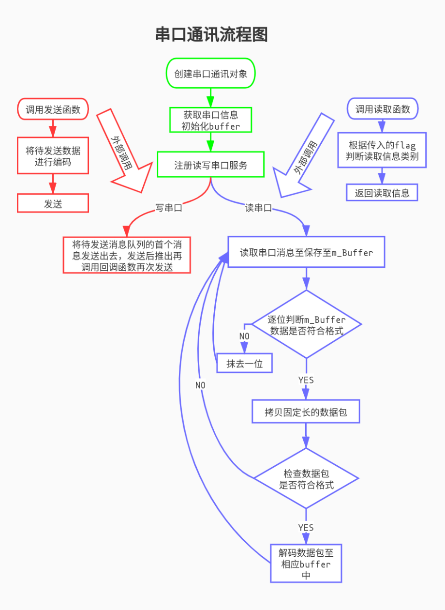

# WMJ 通讯模块

## 模块结构

Port 为通讯基类，SerialPort 和 CanPort 为派生类。WMJProtocol.h 为通讯协议总纲。

## 主要调用

注：

```c++
typedef std::vector<uint8_t> Buffer;
```

读数据函数

```c++
bool Port::sendFrame(Buffer &buffer)
```

参数：

- buffer: 需要发送的数据包

返回：

​	是否成功读取数据

写数据函数

```c++
Buffer Port::readFrame(int)
```

参数：

- int: 读取数据来源的设备名

返回：

​	数据包

## 核心原理



## 调试方法

- 先判断是否成功读写数据，再检查数据格式和数据内容是否吻合
- 可以适当加入 HINT
- 如果是串口模式可以直接进入 cutecom 查看原始数据。
- 一般需要电控协助

## 参数

- Port.yaml
  - SerialPort
    - 通过 cutecom 查验读写地址
    - 波特率一般默认460800。注意如果是首次打开 cutecom 需要手动改设置，后续会保存设置。
  - CanPort
    - 设备名默认 can0
- Control.yaml
  - port_type 根据电控所安装设备选择通讯模式

