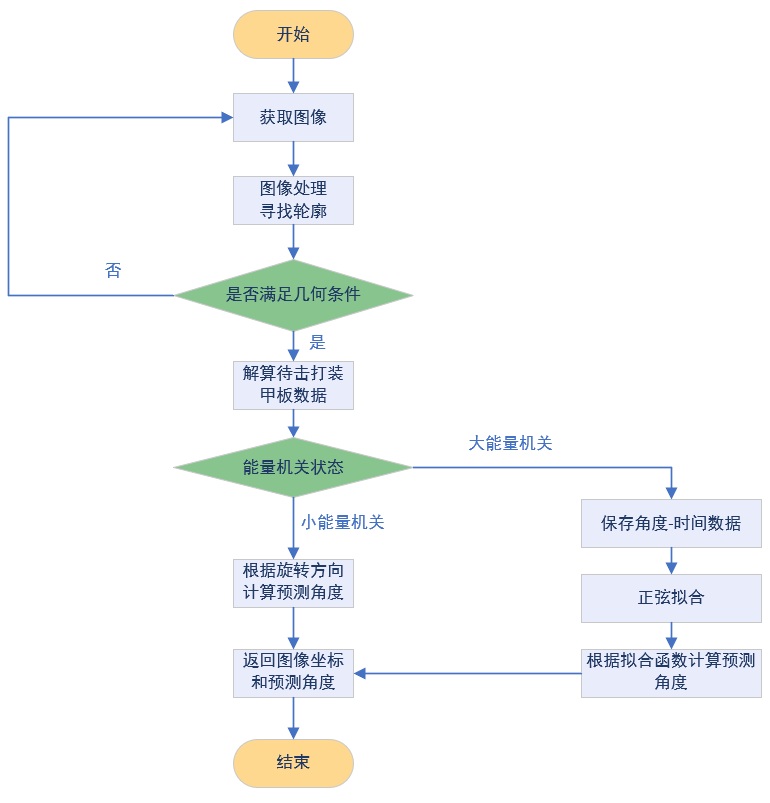

# 能量机关识别库

---

## 1.功能介绍

该能量机关识别库使用传统视觉方式，对输入的图像进行处理，对轮廓进行特征筛选，根据扇叶在一段时间内的角度进行函数拟合和预测，返回预测角度。在状态机中将三维坐标进行旋转和位姿解算控制云台实现击打。

## 2.效果展示

下面是在步兵单项赛全国赛中的比赛记录


## 3.流程图

1. `ArmorTrigger`类


2. `RuneDetector`类
 


## 4.原理介绍

由于采用了双目视觉方案，需通过双线程来提升图像处理速度。将`ArmorTrigger`中`findTarget()`函数作为主函数入口，得到待击打装甲板中心和能量机关圆心在相机坐标系中的三维坐标以及预测角度。将相机坐标系中的坐标转换到 X 轴垂直于能量机关平面的绝对坐标系中，在绝对坐标系中将装甲板中心绕圆心旋转预测角度得到预测后的击打点坐标，再转换到相机坐标系中，通过角度解算计算出云台的`pitch`和`yaw`的角度。

1. `ArmorTrigger`类

   创建两个`RuneDetector`对象，双线程对左右双目图像进行处理，分别获取到左右图像中待击打装甲板中心、能量机关圆心的图像坐标和计算出的预测角度，通过双目测距解算出待击打装甲板中心和能量机关圆心在相机坐标系中的三维坐标。

2. `RuneDetector`类

   1. 图像处理

      - 原图 RGB 通道分离相减，得到对应颜色范围的图像，二值化处理，得到颜色二值化图像
      - 原图转化为灰度图，二值化处理
      - 两张图像进行与运算，得到较为理想的二值化图像。将图像进行适当膨胀，使流动条与待击打装甲板连接，防止断裂

   2. 寻找待击打装甲板

      1. 采用轮廓检测函数`findContours()`检测图像里的所有轮廓，并建立两个等级关系

      2. 查找装甲板

         - 将没有父轮廓的轮廓排除

         - 用轮廓面积与其最小外接矩形的面积之比排除异形轮廓

         - 用轮廓面积筛选，排除过大过小的轮廓

         - 用轮廓最小外接矩形的长宽比筛选

         - 用矩形区域的亮度筛选

      3. 查找扇叶

         上述步骤得到的装甲板轮廓的父轮廓为候选扇叶，对候选扇叶进行条件筛选，

         - 轮廓外接矩形的长宽比

         - 轮廓面积

         - 轮廓面积与其最小外接矩形的面积之比

         - 矩形区域的亮度

         最终得到每个装甲板对应的扇叶

      4. 将每个装甲板最小包围矩形和其对应的扇叶最小包围矩形组成一个类对象，对每个类对象进行条件筛选

         ```c++
         class Vane
         {
            RotatedRect m_big_rect;
            RotatedRect m_small_rect;
         }
         ```

         - 扇叶矩形面积与装甲板矩形面积的比值

         - 扇叶矩形中心与装甲板矩形中心的距离

         最终得到待击打的扇叶

      5. 判断是否激活

         用扇叶轮廓面积与装甲板轮廓面积所得到的比值来判断是否激活

      6. 寻找圆心

         装甲板矩形中心向扇叶矩形中心方向延伸一定距离得到圆心候选区域，在处理后的图像中再次寻找轮廓

         通过

         - 轮廓面积

         - 轮廓外接矩形的长宽比

         - 外接矩形中心是否在候选圆心区域中

         来筛选圆心

   3. 预测

      首先采集三十组待击打装甲板的角度数据来判断旋转方向，并根据能量机关的不同状态来计算预测角度；

      - 匀速运动：

      将预测时间与旋转速度相乘计算得预测角度。

      - 变速运动：

      大能量机关的速度目标函数：`spd = 0.785 * sin(1.884 * t) + 1.305`，spd 的单位为 rad/s， t 的单位为 s，函数周期为 3.335`s`。由于旋转速度测量误差较大，不能满足拟合要求。因此选择对角度函数进行拟合，对上述速度函数进行积分：`rad = -0.785 / 1.884 * cos(1.884 * t) + 1.305 * t + c` ，rad 的单位为 rad，t 的单位为 s。
      连续采集 40 个待击打装甲板的⻆度数据，同时记录其对应的时间戳，将第⼀组数据的时间 t 置 0，其余组数据时间 t 为其时间戳与第⼀组时间戳的差值，与⻆度-时间图像进⾏拟合，计算每⼀个⻆度与函数图像中相应时间的对应⻆度的差值，计算差值的⽅差，记下这个⽅差，再将所有数据的时间 t 全部加 0.1，弧度加 0.1\*1.305，也就是将之前的图像向右上⽅平移，计算差值的⽅差，以此类推，直到加到 3.3（周期为 3.335），共得到 34 个⽅差，筛选其中最⼩值，其对应的函数段为最佳拟合。

      

      已知 40 组数据在图像中的位置，将上述函数向左平移对应单位，令纵截距为第⼀组数据的⻆度，即可得到能量机关⻆度-时间的函数。通过函数关系式和预测时间来计算预测⻆度。拟合完成后，使用之后的每 10 帧图像识别得到的角度进⾏⼀次校正，如果相差太⼤则重新拟合。以上为逆时针转动的处理⽅法，顺时针同理。

## 5.未来优化方向

由于该方案采用传统识别方案，受场地的影响较大，在比赛前需要花费较多时间来调参，因此下个赛季打算使用深度学习的方案进行识别。至于预测就等待新的规则出来再作打算。